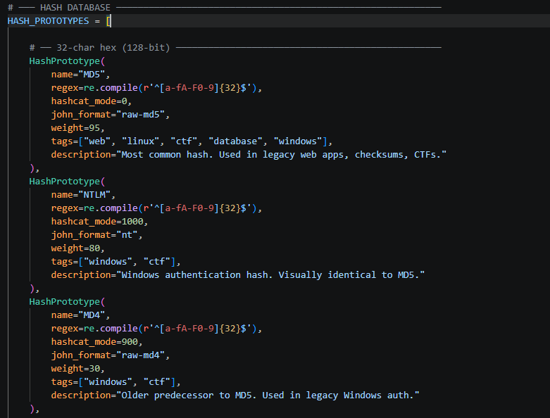
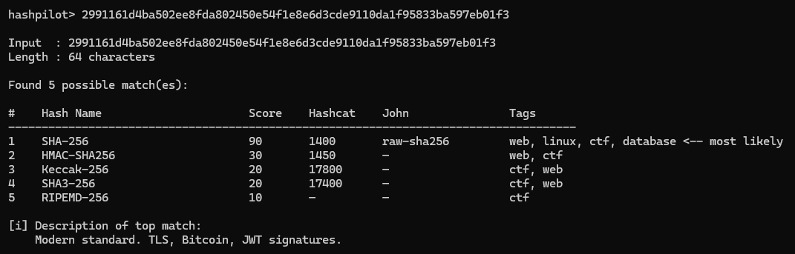

___
## What I Built

Phase 1 is the foundation of HashPilot — a CLI tool that takes a hash string
as input and identifies what hashing algorithm likely produced it. No external
libraries, no fancy UI yet — just pure Python logic running in the terminal.

The entire phase is split across three files,

## The Three Files

### `hash_db.py` — The Database
This is where all the hash "knowledge" lives. I defined a `HashPrototype`
dataclass that stores everything I know about a hash type in one object:

- `name` — the human-readable name like "MD5" or "bcrypt"
- `regex` — a compiled regex pattern that matches the hash's structure
- `hashcat_mode` — the `-m` number used in Hashcat for cracking
- `john_format` — the format flag for John the Ripper
- `weight` — a number from 1–100 representing how commonly this hash
  appears in the real world (MD5 = 95, Adler32 = 10)
- `tags` — context labels like `["web", "linux", "windows", "ctf"]`
- `description` — one line explaining where this hash is typically found

I populated this with 35+ hash types covering everything from MD5 and bcrypt
to WPA2 PMKID and Django's PBKDF2 format.

The key insight I learned here: **many hash types share the same regex**.
MD5, NTLM, MD4 and LM all match `^[a-fA-F0-9]{32}$` because they all
produce 32 hex characters. The `weight` field is what separates them in
ranking — which is why MD5 always comes out on top for a 32-char hex string.

A sample snippet of the prototype functions in the file:



### `matcher.py` — The Engine
This is the brain of the tool. The `HashMatcher` class loops through every
prototype in the database, runs `regex.fullmatch()` on the input hash, and
collects every prototype whose pattern matches. It then sorts the results by
score (highest first) and returns them as a list of `MatchResult` objects.

I used `fullmatch()` instead of `match()` deliberately because `fullmatch()` requires
the entire string to satisfy the pattern, which prevents false positives from
partial matches.

In Phase 1, the score is simply the `weight` value from the database. Phase 2
will multiply this by a context factor to make rankings smarter.

I also added a `match_summary()` method that returns a dict. This is the
hook I'll use later for JSON output mode in Phase 4.


### `cli.py` — The Interface
This is what the user actually runs. It handles two modes:

- **Argument mode:** `python cli.py <hash>` — identify one hash and exit
- **Interactive mode:** `python cli.py` — keeps prompting until I type `exit`

It uses `argparse` from stdlib to handle the command-line arguments and
prints results as a formatted table showing hash name, confidence score,
Hashcat mode, John format, and context tags.

___
## How to Run It

All three files must be in the **same folder**. Then open a terminal,
`cd` into that folder, and run:

```bash
# Identify a single hash directly
python cli.py 5d41402abc4b2a76b9719d911017c592

# Interactive mode — keep entering hashes
python cli.py

# Skip the ASCII banner
python cli.py --no-banner
```

No `pip install` needed. Runs on Python 3.10+ with zero external dependencies.

---

## Sample Hashes to Test in the CLI

Copy any of these and paste into the interactive prompt or pass as an argument.

### MD5

5d41402abc4b2a76b9719d911017c592
*(hash of the word "hello")*

### SHA-1

aaf4c61ddcc5e8a2dabede0f3b482cd9aea9434d
*(hash of "h")*

### SHA-256

2cf24dba5fb0a30e26e83b2ac5b9e29e1b161e5c1fa7425e73043362938b9824
*(hash of "hello")*

### SHA-512

9b71d224bd62f3785d96d46ad3ea3d73319bfbc2890caadae2dff72519673ca72323c3d99ba5c11d7c7acc6e14b8c5da0c4663475c2e5c3adef46f73bcdec043
*(hash of "hello")*

### bcrypt

*(a real bcrypt hash)*
$2b$12$EixZaYVK1fsbw1ZfbX3OXePaWxn96p36WQoeG6Lruj3vjPGga31lW

### MD5 Crypt (Unix /etc/shadow)
$1$xyz12345$FPkBMmBpEXJghi3EBuTkR1
*(Unix shadow file format)*


---

## What the Output Looks Like:



The top result is always the most likely match based on real-world frequency.
The Hashcat and John columns are directly usable if I ever need to crack the hash.

---

## Known Limitations Going Into Phase 2

- **BLAKE2b ranks below SHA-512** — both produce 128 hex chars, but SHA-512
  has a higher weight so it wins. Context scoring in Phase 2 will fix this.

- **BLAKE2s is missing** from the database entirely — it wasn't added in Phase 1
  and will be included when I expand the hash database in Phase 2.

- **Score is flat** — right now every score is just the raw weight with no
  adjustment for context. A Windows hash like NTLM should score higher if I
  specify `--context windows`. That's Phase 2's main feature.