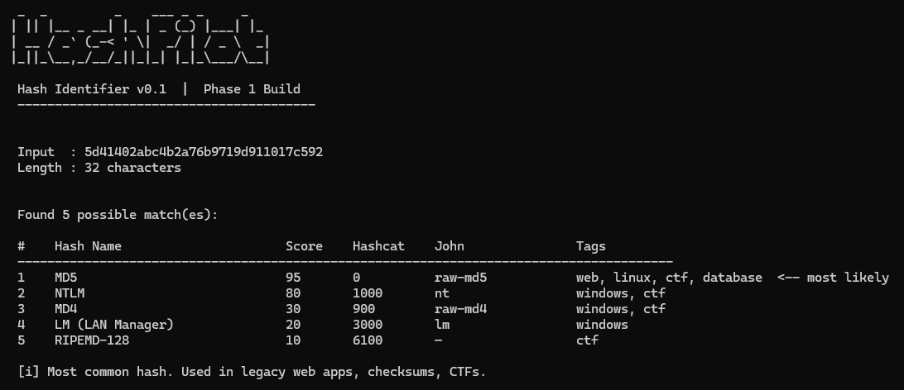
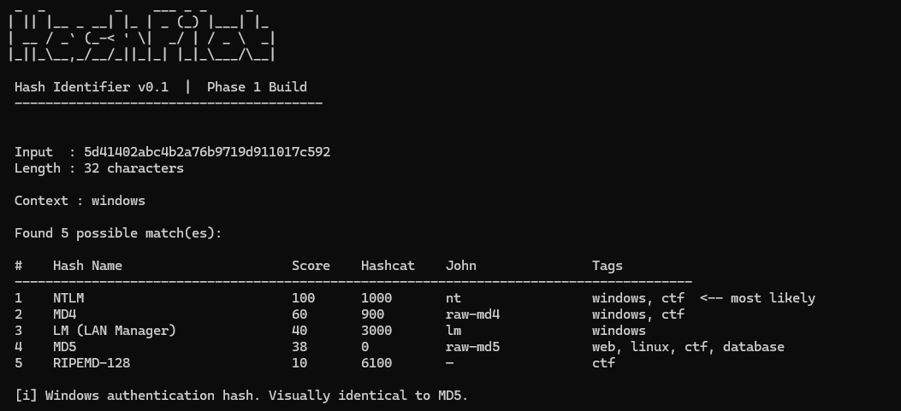
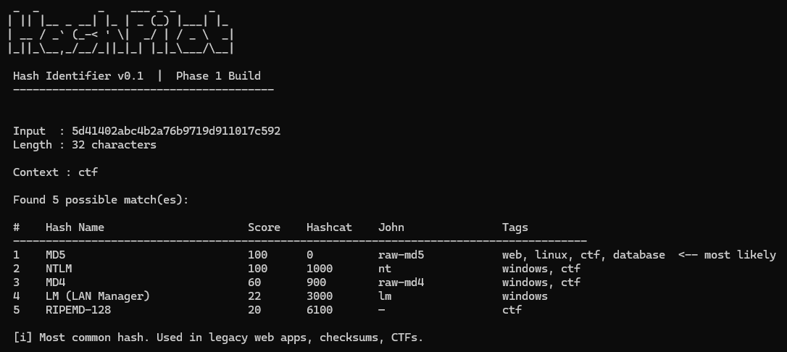
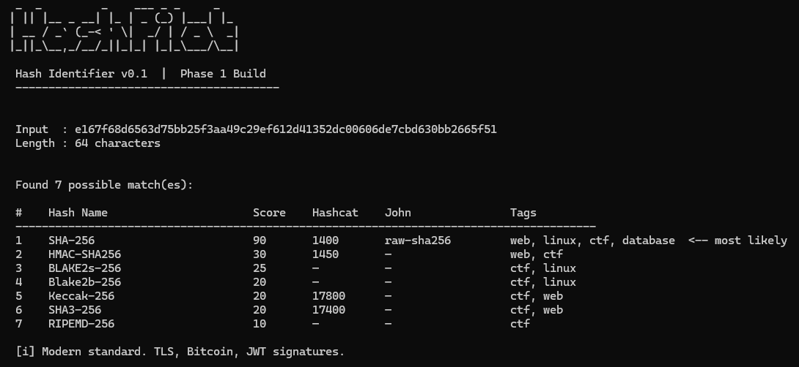
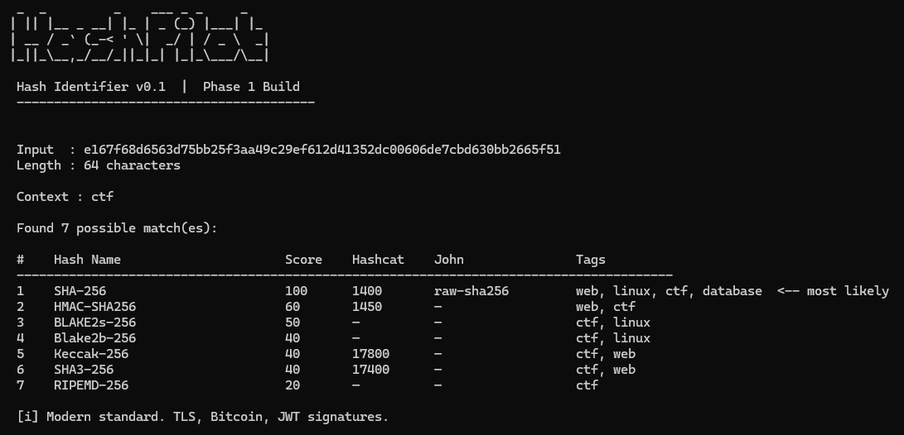

___

Phase 2 introduced context-aware confidence scoring — the feature that makes HashPilot genuinely smarter than every existing hash identifier tool. Instead of ranking results purely by how common a hash is in the wild, the tool now accepts a 
`--context` flag that shifts scores based on *where* the hash was found.

Right now the score is just the raw `weight` from the database. Phase 2 adds a 
`--context` flag so the user can say _"I found this hash in a Windows environment"_ and the tool will boost Windows-relevant hashes (NTLM, LM) and suppress Linux-only ones (SHA-512 Crypt).

**The core idea**: a hash found in a Windows memory dump should rank NTLM higher than MD5, even though MD5 is globally more common. Context changes everything.

The scoring formula now becomes:

$$
score=baseWeight×contextMultiplier
$$

Where `context_multiplier` is looked up from a table based on whether the hash's tags overlap with the chosen context.

___
## The New File: `scorer.py`

It does two things:

**1. Defines the multiplier table (`CONTEXT_MULTIPLIERS`)**
A nested dict structured as `{ context: { tag: multiplier } }`.
For example, in the `"windows"` context:
- hashes tagged `"windows"` get multiplier `2.0` (boost)
- hashes tagged `"linux"` get multiplier `0.4` (penalty)
- hashes tagged `"web"` get multiplier `0.8` (slight penalty)

Available contexts: `windows`, `linux`, `web`, `database`, `ctf`, `wifi`

**2. Two functions:**

`get_multiplier(tags, context)`: takes a hash's tag list and the user's
context string, looks up each tag in the multiplier table, and returns the
highest boost found. If all tags have penalties and no boosts, it returns the
worst penalty. If no tags match the context table, it returns 1.0 (neutral).

`compute_score(base_weight, tags, context)`: multiplies base_weight by the
multiplier and caps the result at 100. This is what `matcher.py` calls.

___
## Testing

Here, running a NTLM hash value (windows native hash) without the context gives us:

```
python cli.py 5d41402abc4b2a76b9719d911017c592
```



Now, with the context:

```bash
python cli.py --context windows 5d41402abc4b2a76b9719d911017c592
```



Now with the context, NTLM overtake MD5 on a 32-char hex hash

With ctf context:

```bash
python cli.py --context ctf 5d41402abc4b2a76b9719d911017c592
```



___

## The Bug I Found While Testing

When I ran a 32-char hex hash with `--context windows`, both NTLM and MD5
showed a score of 100. I expected NTLM at 100 and MD5 lower.

**Why it happened:** MD5 had `"windows"` in its tags, so it was getting the
`2.0` windows multiplier — giving `95 × 2.0 = 190`, capped to 100.

**The fix:** Removed `"windows"` from MD5's tags in `hash_db.py`. After the
fix, NTLM scored 100 (`80 × 2.0`) and MD5 scored 76 (`95 × 0.8`), which is
the correct separation.

**Lesson learned:** Tags must reflect where a hash is *natively used*, not
just where it *can appear*. MD5 exists everywhere but it's not a
Windows-specific mechanism.

___

## Limitations

I tested with a SHA3-256 hash and ran it with `--context ctf`. SHA-256 still
came out on top. The reason: SHA-256 and SHA3-256 produce structurally
identical output — both are 64 hex characters with the same character set.
Their regex patterns are exactly the same: `^[a-fA-F0-9]{64}$`.

No regex-based tool — including Name-That-Hash, hashID, or HashPilot — can
distinguish SHA-256 from SHA3-256. They are fundamentally indistinguishable
by structure alone. The only separators are:
- Knowledge of which application generated the hash (e.g. Ethereum → Keccak-256)
- Having the original plaintext to verify against both algorithms

This is a known limitation of the entire field of regex-based hash
identification, not just my tool.

A SHA3-256 hash without context:

```
python .\cli.py e167f68d6563d75bb25f3aa49c29ef612d41352dc00606de7cbd630bb2665f51
```



With context:

```bash
python .\cli.py --context ctf e167f68d6563d75bb25f3aa49c29ef612d41352dc00606de7cbd630bb2665f51
```


___

## What Context Does NOT Fix

Context scoring improves ranking but cannot disambiguate hashes that share
identical regex patterns. Structurally identical pairs include:

| Hash A    | Hash B      | Length | Why indistinguishable        |
|-----------|-------------|--------|------------------------------|
| MD5       | NTLM        | 32 hex | Same length, same charset    |
| SHA-256   | SHA3-256    | 64 hex | Same length, same charset    |
| SHA-256   | Keccak-256  | 64 hex | Same length, same charset    |
| SHA-512   | BLAKE2b-512 | 128 hex| Same length, same charset    |
| SHA-1     | RIPEMD-160  | 40 hex | Same length, same charset    |

___


## Changes did in phase 2:

- Added New File: `scorer.py` , Context-aware scoring engine which applies a multiplier to base weight based on user-supplied context

- Updated: `hash_db.py` , Added missing hash types like Blake2s-256, Blake2b-256

- Updated: `matcher.py` , Core matching engine with context-aware scoring

- Updated: `cli.py` , Only two small changes, add the `--context` argument and pass it to `matcher.match()`