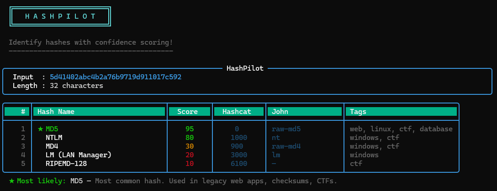

___

## What Phase 4 Added

Phase 4 was purely a visual upgrade — no logic, no scoring, no new hash types.
I replaced all the plain `print()` statements in `cli.py` with Rich library
components: coloured tables, styled panels, and score-based colour coding.
Every other file stayed completely untouched.

The goal was to make the CLI output look professional.

The Only File That Changed: `cli.py`

___

## Installing Rich

```bash
pip install rich
```

Rich is the only external dependency in the entire project. Everything
before Phase 4 ran on pure Python stdlib.

___

## Rich Components I Used

### `Console`
The main Rich object. Replaces `print()` entirely.
```python
from rich.console import Console
console = Console()
console.print("[bold green]Hello[/bold green]")
```
Rich markup uses `[tag]text[/tag]` syntax inside strings — similar to HTML
but processed by Rich at render time, not by the browser.

### `Table`
Builds formatted tables with columns, alignment, borders and header styles.
```python
from rich.table import Table
table = Table(box=box.ROUNDED, border_style="cyan", header_style="bold white on dark_cyan")
table.add_column("Name", style="bold white", width=30)
table.add_row("MD5")
console.print(table)
```

### `Panel`
A bordered box around content. I used it for the input summary at the top
of every result — shows the hash, length, context and hint in a clean frame.
```python
from rich.panel import Panel
console.print(Panel("content here", title="HashPilot", border_style="cyan"))
```

### `Text`
A Rich string object that can carry inline styles. I used it to apply
bold green to the top-ranked hash name and add a ★ prefix to it.
```python
from rich.text import Text
name_text = Text("★ MD5", style="bold green")
```

### `console.rule()`
Draws a horizontal divider line with optional centred label. I used it
in file mode to separate each hash result:
```python
console.rule("[dim]Hash 1 of 4[/dim]")
```

___

## Score Colour Coding

I wrote a `score_colour()` function that maps score ranges to Rich colour
strings. This makes the tool look confident with its output. 
A sample output:

```
python cli.py 5d41402abc4b2a76b9719d911017c592
```




Color code:

```python
def score_colour(score: int) -> str:
    if score >= 80:   return "bold green"
    elif score >= 50: return "yellow"
    elif score >= 25: return "orange3"
    else:             return "red"
```

___

## Output Structure After Phase 4

Every result now renders in three parts:

1. **Input Panel** — rounded cyan border box showing:
   - Input hash value (cyan)
   - Character length
   - Context (magenta, if supplied)
   - Hint (blue, if supplied)

2. **Results Table** — rounded corners, dark cyan header, columns:
   - `#` rank, Hash Name (★ on top result), Score (colour-coded),
     Hashcat mode, John format, Tags

3. **Top Match Line** — printed below the table:
   `★ Most likely: SHA-256 — Modern standard. TLS, Bitcoin, JWT signatures.`

